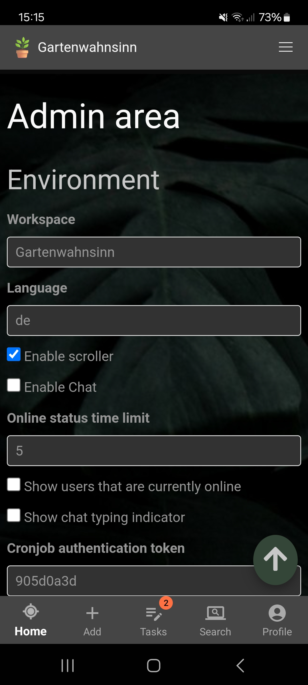

## Admin area

The admin area is used to manage your application. Only admins can have access to this section.
Here you can manage some application settings that might be changed a little more often.
You can also manage user accounts and locations. New created users will recieve a registration e-mail in order to get login instructions.
You can also create new locations, modify existing ones or delete locations. When deleting a location, you need to select an alternative
location to which all affected plants will be moved to.
It is recommended to access the admin area via a desktop screen, but you can use it on mobile screens as well.

Note: You can also check for new versions via the related button. When issued the command then the system will try to check whether a new
version is available or not. If so then it shows you the new version and a link to obtain the new version.

[Go back](index.md)