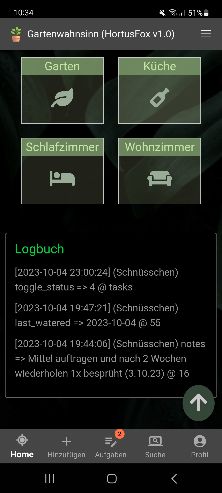

## Dashboard

The dashboard provides you with an overview of various important information. The following information are available:

### Statistics
The statistics give you an overview of some numbers in your workspace.

### Unhealthy plants & locations
If you have any unhealthy plants, they will show up in this section. If not you will get informed that everything seems to be fine.
Down below you will find a list of all locations that are configured in the database. All plants are subject to a specific location
of your environment. Before adding any plants you need to setup these locations in the database.

### Log
The log shows the recent history of actions performed by all users. You can toggle if you want to see this log in your <a href="profile.md">preferences</a>. 

[Go back](index.md)
