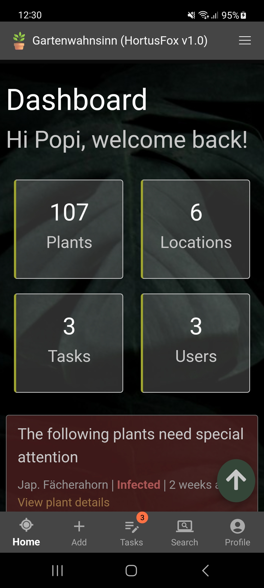
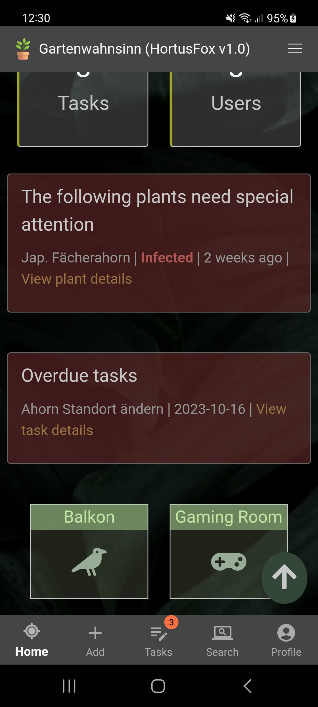
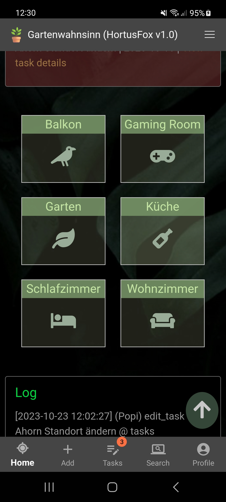
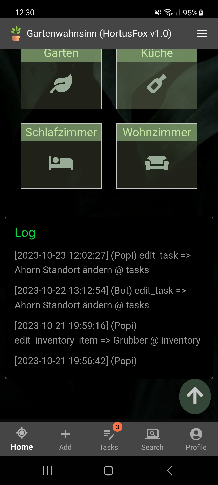

## Dashboard

The dashboard provides you with an overview of various important information. The following information are available:

### Statistics
The statistics give you an overview of some numbers in your workspace.

### Warning section
If you have any unhealthy plants, they will show up in this section. If not you will get informed that everything seems to be fine.
You will also see a list of all overdue tasks if there are any.

### Locations
In this section you will see your locations. Plants have to be assigned to locations, so in order to see the list of plants
of a specific location you can just navigate to it via the dashboard. Alternatively you can also use the navbar menu to quickly
navigate to a location regardless what page you are currently viewing.

### Log
The log shows the recent history of actions performed by all users. You can toggle if you want to see this log in your <a href="profile.md">preferences</a>. 

[Go back](index.md)
