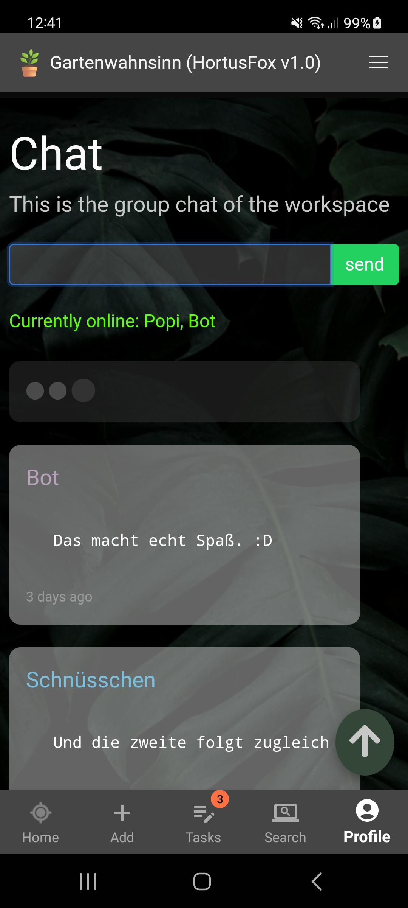

## Group chat

The group chat can be handy if you haven't establish a communication channel for your local environment and multiple
users are taking care of your collaborative plant collection. You can exchange chat messages here. The chat is also
live updated and you can also see a list of users that are currently online in the app. The three animated dots indicate
that someone is currently typing a message. The online user list as well as the typing indicator can be adjusted via
the .env configuration file.

[Go back](index.md)