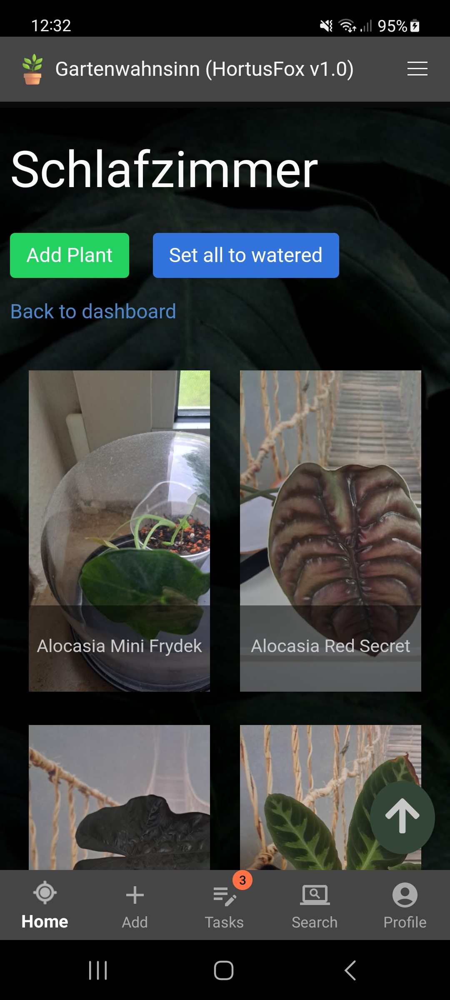
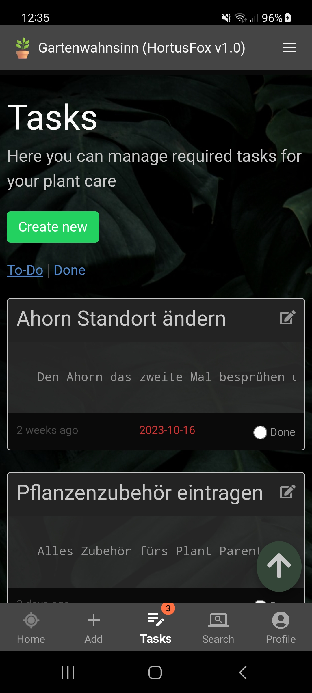

<h1 align="center">
     
    HortusFox Documentation
</h1>

    Current version: <strong><code>1.0</code></strong>

    
    
    
    

    <iframe width="560" height="315" src="https://www.youtube.com/embed/zbUeQ-o2odQ?si=e9eOKGJ40HcPVjb6" title="HortusFox" frameborder="0" allow="accelerometer; autoplay; clipboard-write; encrypted-media; gyroscope; picture-in-picture; web-share" allowfullscreen></iframe>

## Description
Welcome to the documentation of HortusFox - a self-hosted collaborative plant management system.
HortusFox is a self-hosted collaborative platform that helps you keeping track of all your plants
in your local environment. It is especially suited for tech savy plant parents who want to use an
open-source plant management app where they also have control over their data. The system is made
as a web application and there is also an android mobile phone app available.

## Installation
1. <a href="https://github.com/danielbrendel/hortusfox-web">Install the web application</a>
2. <a href="https://github.com/danielbrendel/hortusfox-app-android">Build the mobile app</a>

## Features
1. [The Dashboard](dashboard.md)
2. [Manage plants](plants.md)
3. [Tasks](tasks.md)
4. [Inventory](inventory.md)
5. [Searching](searching.md)
6. [Group Chat](groupchat.md)
7. [Profile](profile.md)
8. [Admin](admin.md)

## Screenshots

    &nbsp;
    &nbsp;
    &nbsp;
    &nbsp;
    &nbsp;
    &nbsp;

