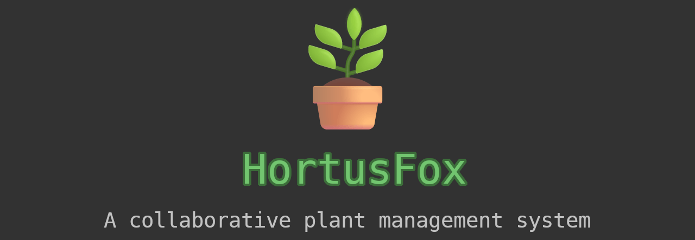

<h1 align="center">
    
</h1>

    Current version: <strong><code>1.0</code></strong>

    
    
    
    

## Description
Welcome to the documentation of HortusFox - a self-hosted collaborative plant management system.
HortusFox is a self-hosted collaborative platform that helps you keeping track of all your plants
in your local environment. It is especially suited for tech savy plant parents who want to use an
open-source plant management app where they also have control over their data. The system consists
of a web backend, which is the biggest part of the app, as well as a mobile app that is shipped
to the users Android phones or tablets.

## Table of contents
1. [Installation](installation.md)
2. [The Dashboard](dashboard.md)
3. [Manage plants](plants.md)
4. [Tasks](tasks.md)
5. [Inventory](inventory.md)
6. [Searching](searching.md)
7. [Group Chat](groupchat.md)
