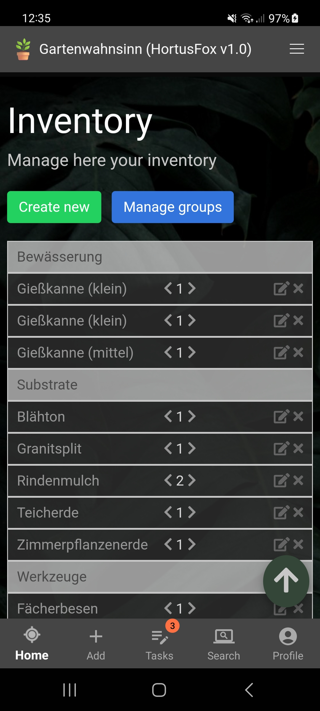

## Inventory

The inventory is useful if you want to keep track of all your items that are needed to take 
care of your plants. Sometimes it can be quite a struggle to remember all things you bought
or collected for taking care of your plants especially if you own a large number of plants.
The inventory can assist you with this.

Items in your inventory are categorized by groups. So in order to add something to your inventory,
you first need to add some groups. When adding groups you need to enter a token (which is mostly
used to sort the inventory list in an ascending order) and the name of the group, e.g. "Tools".

When adding a new item to the inventory you need to specify the following information:
- Name
- Group
- Preview photo (optional)
- Description (optional)

After adding an item its counter is initially set to zero. You can then manually increment or
decrement the counter to reflect your situation.

[Go back](index.md)