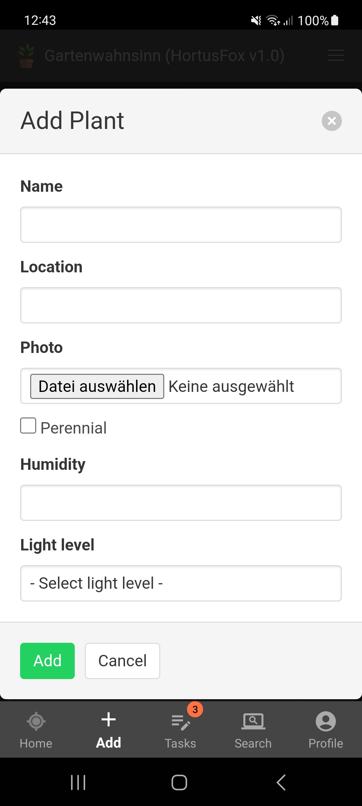
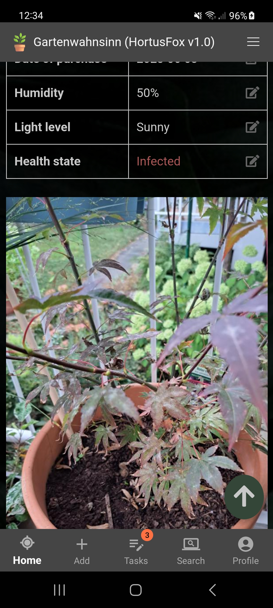
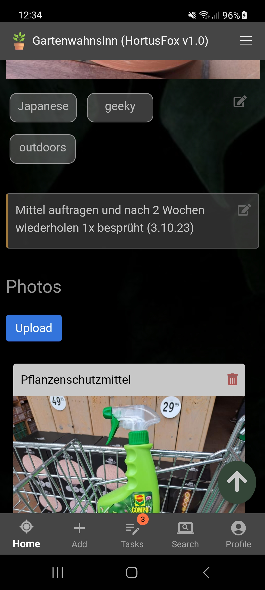

## Manage plants

In order to view your plants of a location, you first need to go to a location via your dashboard or the navigation menu.
Then you will see a list of all of your plants in that location. They are shown in a card style with name and preview image.

Here you can also add a new plant to this location.

The following fields are mandatory:
- Name: The name of the plant
- Location: The location of the plant
- Photo: A preview photo of the plant
- Perennial: Whether this plant is perennial or not
- Humidity: Humidity percentage (0% - 100%)
- Light level: Either sunny, half-shade or full-shade

If you go to a plants' details, you will see various information and different actions are available.

&nbsp;
&nbsp;
&nbsp;

You can:
- View and edit various plant details
- View and edit a preview photo
- Assign tags for a better categorization
- Add detailed notes
- Manage photo gallery for this plant
- Remove a plant

[Go back](index.md)