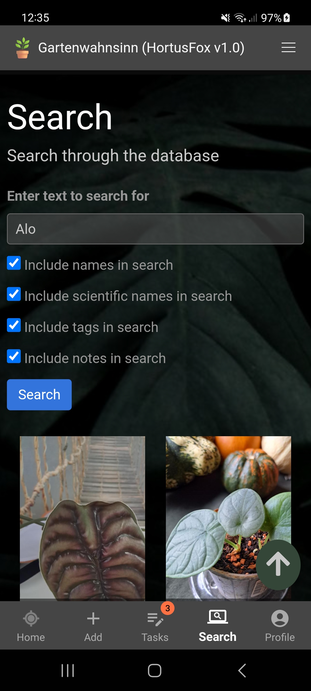

## Searching

You can use the search feature to look up plants in your database. This way you can find a specific plant or
event plants that match certain criteria.

Just enter your search phrase and then hit the search button. 

Currently you can specify what columns shall be included in the search:
- Plant name
- Scientific name
- Tags
- Notes

[Go back](index.md)