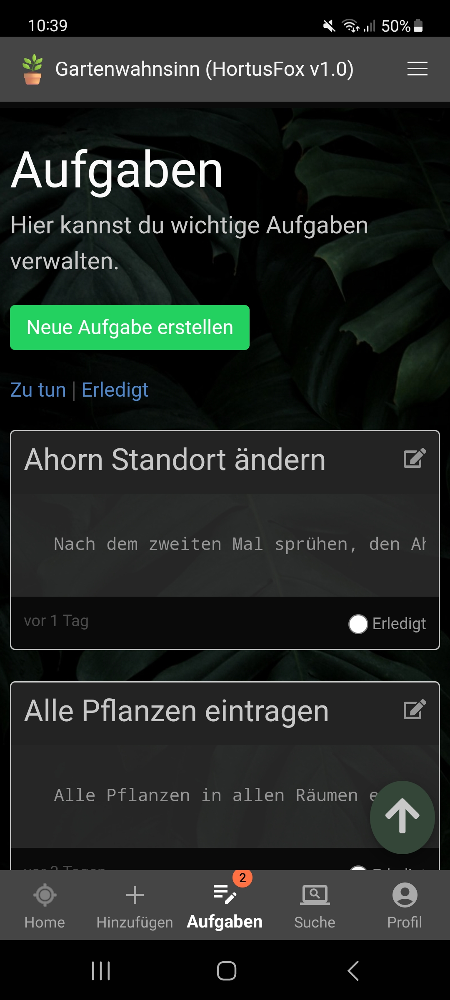

## Tasks

Tasks are useful to keep track of everything you need to do to take care for your plants.
You can create tasks defining title and description. 

When you are done with a task you can just click on "done" setting it to completed.
You can also view your completed tasks by using the filters.

[Go back](index.md)