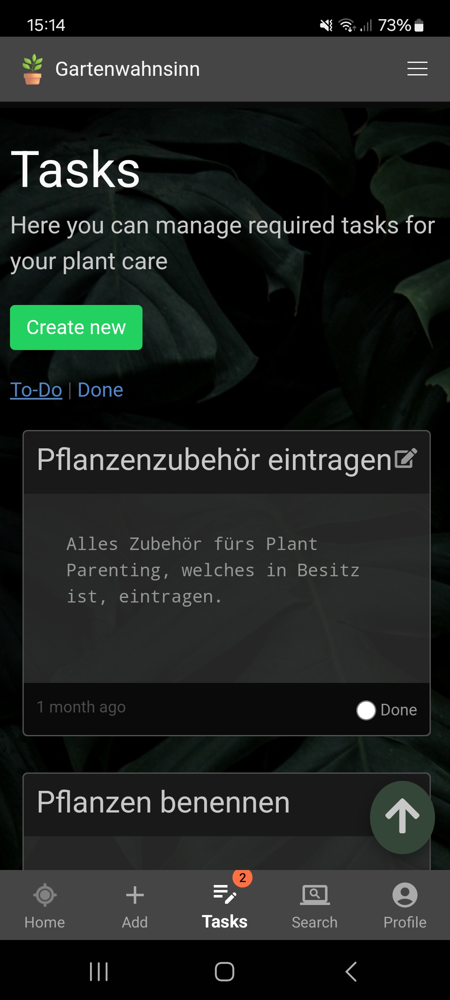

## Tasks

Tasks are useful to keep track of everything you need to do to take care for your plants.
You can create tasks defining title, description and due date (if desired). 

If you have specified a due date and it's overdue then it will also be shown in the 
warning section of the dashboard. 

When you are done with a task you can just click on "done" setting it to completed.
You can also view your completed tasks by using the filters.

If you have cronjobs enabled along with valid SMTP settings then the system can send
reminder e-mails to your users (if they have subscribed to them). This way they can get
informed about overdue tasks or tasks that are due the next day.

[Go back](index.md)